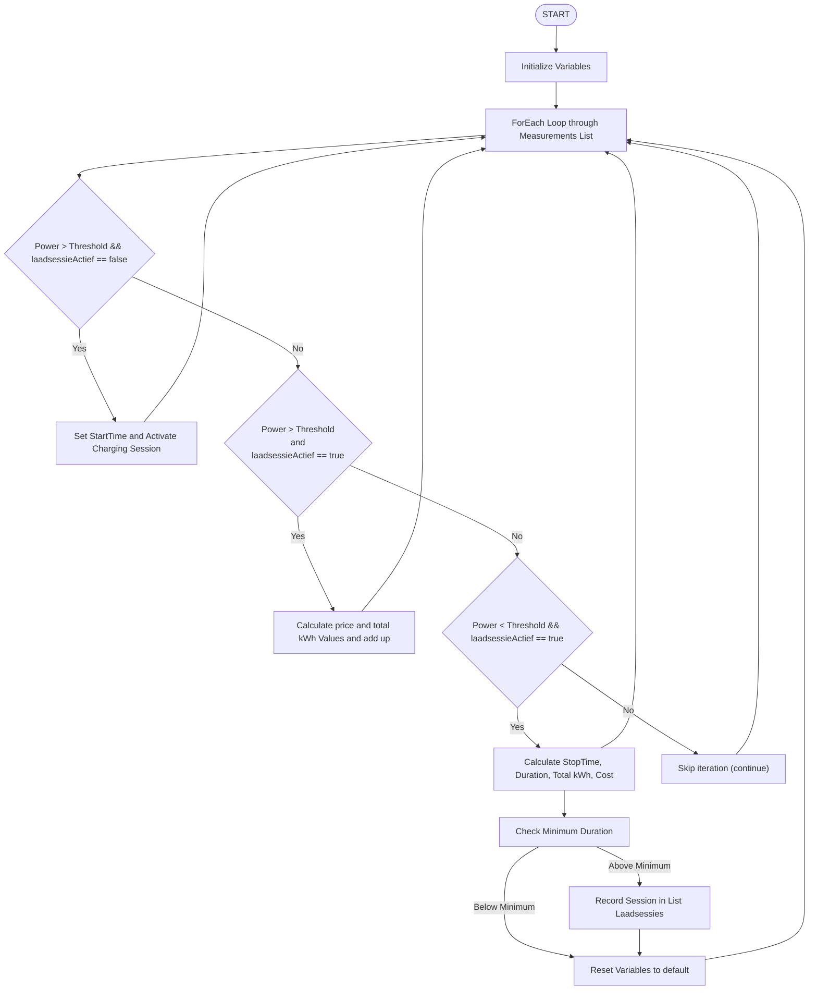

# Flowchart

```mermaid

flowchart TD
    START([START]) --> Start
    Start["Initialize Variables"] --> Loop
    Loop["ForEach Loop through Measurements List"] --> CheckStart
    CheckStart{"Power > Threshold && laadsessieActief == false"}

    CheckStart -- "Yes" --> StartSession["Set StartTime and Activate Charging Session"] --> Loop
    CheckStart -- "No" --> CheckContinue{"Power > Threshold \nand \nlaadsessieActief == true"}

    CheckContinue -- "Yes" --> ContinueSession["Calculate price and total kWh Values and add up"] --> Loop
    CheckContinue -- "No" --> CheckEnd{"Power < Threshold && laadsessieActief == true"}

    CheckEnd -- "Yes" --> EndSession["Calculate StopTime, Duration, Total kWh, Cost"] --> Loop
    CheckEnd -- "No" --> DoNothing["Skip iteration (continue) "] --> Loop

    EndSession --> MinDuration["Check Minimum Duration"]
    MinDuration -- "Above Minimum" --> RecordSession["Record Session in List Laadsessies"]
    MinDuration -- "Below Minimum" --> ResetVars["Reset Variables to default"]

    RecordSession --> ResetVars --> Loop


```
